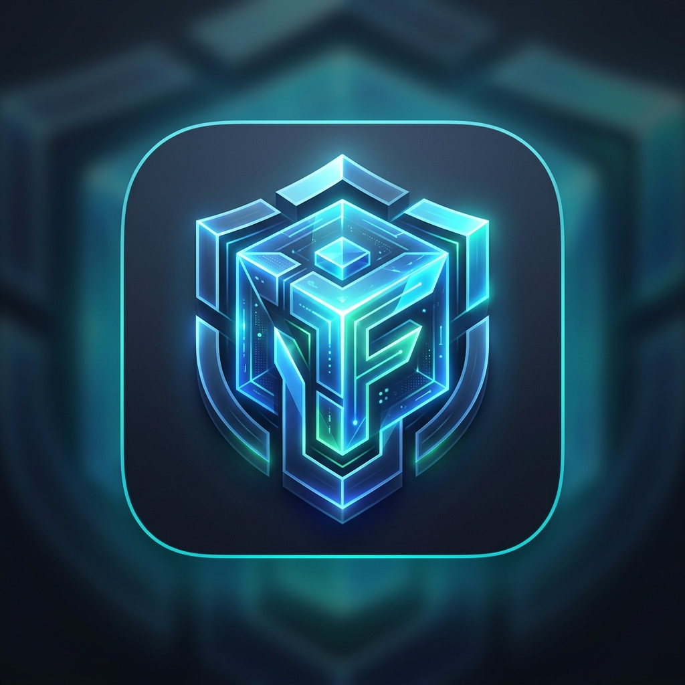

# Fortiq

<p align="center">
  
</p>

Fortiq is a sovereign disaster recovery platform for organizations that require verifiable, encrypted, and tamper-resilient backups under their own sovereign control.

The core promise of the platform:

> Data can be recovered without relying on Fortiq cloud, a Fortiq account, or the ongoing existence of the Fortiq company.

---

## Current Status (.NET 10 LTS)

Fortiq is under active development. Current code enforces verified security invariants, cryptographic guarantees, and automated recovery tests across **17 source projects** and **7 test projects**:

- **Pinned Engine Execution**: Restic 0.19.1 execution via `Fortiq.Infrastructure.Restic` with pre-execution SHA-256 binary validation, handle-locking (`FileShare.Read`), and volume/index identity checks to eliminate TOCTOU attacks.
- **Envelope Encryption**: Deterministic CBOR (RFC 8949) `KeyEnvelopeV1` specification supporting:
  - `Bip39RecoveryEnvelopeV1`: 256-bit entropy encoded into a standard English mnemonic (PBKDF2-HMAC-SHA512 + HKDF).
  - `WindowsTpmEnvelopeV1`: Non-exportable keys secured via Microsoft Platform Crypto Provider with public key fingerprint validation.
  - `RecoverySecretEnvelope`: HKDF-SHA-256 key derivation with authenticated AES-256-GCM wrapping.
- **Recovery Kits & Provisioning**: Atomic transactional repository provisioning (`RepositoryProvisioner`) generating self-contained recovery kits (`kit.json`). Rollback safety with `provisioning-intent.json`.
- **Zero-Dependency Emergency CLI**: `Fortiq.Recover` provides an autonomous command-line interface (`inspect`, `snapshots`, `check`, `restore`) reading mnemonics exclusively from standard input to prevent credential leakage in process listings or shell history.
- **Atomic Operation Evidence**: `FileSystemOperationReceiptStore` writes a structured receipt (`fortiq.operation-receipt`) for every backup, check, prune, drill, and restore operation, written whole and moved into place so a reader never sees a partial record. Receipts are plain JSON: they are the evidence monitoring reads and an audit trail of what ran, but they carry no MAC, signature or hash chain and are **not** tamper-evident against someone who can write to the directory. A tamper-evident ledger is specified in ADR-007 and not yet implemented.
- **S3 Object Lock & Ransomware Defense**: Support for S3-compatible object storage with Object Lock immutability verification. `S3HiddenObjectRecovery` automatically unmasks repositories subjected to malicious delete-marker tampering without touching versioned data blobs.
- **Windows Platform Consistency**: Volume Shadow Copy Service (VSS) integration (`--use-fs-snapshot`) for point-in-time filesystem captures. (USN Change Journal hints are specified but not yet implemented.)
- **Scheduling & Windows Service**: Robust recurrence engine (`Fortiq.Scheduling`) resolving wall-clock timezones, DST shifts, and missed-run coalescing. Unattended background execution hosted in `Fortiq.Service` authenticated via TPM device keys.
- **Verifiable Health Observability**: `Fortiq.Monitoring` evaluates whether repositories are *proven recoverable* (distinguishing `Recoverable`, `Unproven`, and `AtRisk`). Publishes status to `health.json` and Prometheus textfile (`fortiq.prom`). Storage protection is re-checked against the storage on every pass, not read from what the kit recorded at provisioning: retention removed later is reported as `storage-protection-lost`, and storage that cannot be reached as `storage-protection-unknown` — never as protected.
- **Backup Anomaly Observation**: `BackupAnomalyDetector` compares each backup against the same repository's median history and reports deduplication collapse and added-data or changed-file spikes — the shape a source rewritten in place produces, which total backup size alone cannot show. Findings are surfaced with their numbers and never name a cause or change the recoverability verdict.
- **Scheduled Retention**: opt-in per repository (`ScheduledRetentionRunner`). A schedule file that says nothing about retention keeps everything forever — there is no safe default for deleting somebody's backups. Runs take the repository exclusively, never catch up on missed occurrences, and a busy repository is left alone rather than waited for.
- **Automated Restore Drills**: opt-in per-repository recurrence (`ScheduledDrillRunner`) restores the newest snapshot into a disposable directory unattended, reconciles what came back, and records the proof as a receipt. Drills never catch up on missed occurrences, keep their history apart from the backup's, and a failed drill never stops backups.
- **Modern Desktop UI & Visual System**: Cross-platform Avalonia UI application (`Fortiq.Desktop`) with a light Fluent v2 palette, native Windows folder dialogs, resilient zero-state onboarding, Protection Setup Wizard with a 4x6 mnemonic card grid and challenge verification, and an in-app restore-proof action (`ProveRecoveryAdapter`) that restores the newest snapshot and reconciles what came back.
- **Per-Repository Storage Credentials**: object storage keys are held per repository in a machine store (`StoredObjectStorageCredentials`), encrypted with Windows DPAPI at machine scope through `crypt32` directly, and managed with `Fortiq.Service credentials set|remove|list` — the secret key is read from standard input, never from a command line. A credential issued for one bucket is not silently the credential for every other repository. Environment variables remain as a fallback for tooling and CI.

  Writes restrict the credentials directory to its owner, SYSTEM and local administrators. Reads reject broad directory or file grants; replace an unsafe legacy credential with `credentials set` to repair its permissions. DPAPI machine scope binds encryption to Windows, while the ACL controls access on the same machine. The owner and administrators remain trusted; a custom service identity requires a separate access policy.

- **Restore proof evidence**: only a successful `restoreProof` receipt, persisted after disk reconciliation, counts as recovery proof. Legacy `restore` receipts remain operation history and require a fresh drill to establish proof. Failed drills remain visible independently of later successful backups.
- **Report freshness**: the desktop refreshes every 30 seconds and treats reports older than five minutes as stale. Prometheus exposes `fortiq_health_report_timestamp_seconds`; consumers must check its age before trusting saved gauges.
- **Isolated Password Broker**: One-time ephemeral Named Pipe broker (`Fortiq.PasswordHelper`) verifying client PID, open binary handle identity, account security context, and optional Authenticode digital signatures.

---

## Building and Testing

Requires the .NET SDK version specified in [global.json](global.json).

```powershell
# Run all unit, contract, integration, and security tests
dotnet test Fortiq.sln --configuration Release
```

All projects enforce nullable reference types, recommended Roslyn analyzers, and treat all warnings as errors (`TreatWarningsAsErrors=true`).

### Engine Acquisition

Pinned metadata for the restic engine is defined in [engines/manifest.json](engines/manifest.json). The binary is not stored in Git; obtain and verify it using the PowerShell acquisition script:

```powershell
./scripts/Get-Engine.ps1
```

The script verifies the SHA-256 archive hash prior to extraction, then verifies the file length and SHA-256 hash of the extracted executable. Any hash mismatch terminates immediately and cleans up disk artifacts. Ambient or globally installed binaries are never executed.

### S3 & Object Lock Testing

To spin up a local 4-node S3 cluster with Object Lock support for integration tests:

```powershell
./scripts/Get-TestStorage.ps1
```

---

## Architectural Principles

1. **Recoverable First**: A backup job completing without errors is insufficient; recovery capability must be continuously and verifiably demonstrated.
2. **Sovereign Control**: The customer retains exclusive control over encryption keys, data placement, access policies, and network dependencies.
3. **Resilient Under Compromise**: An endpoint compromise must not allow an attacker to destroy immutable backup history.
4. **Deterministic Core**: Cryptography, policy enforcement, and restore sequences never depend on cloud services or generative AI.
5. **Portable Survival**: The recovery envelope format and emergency CLI (`Fortiq.Recover`) are designed to outlive the primary product.

---

## Documentation & Architecture Specifications

Architecture specifications and Architecture Decision Records (ADRs) are maintained in the local workspace archive (`docs/`). Only code-level documentation and repository policies are published directly to the public GitHub repository ([README.md](README.md) and [SECURITY.md](SECURITY.md)).

### Architectural Specifications Overview

| Topic | Focus Area & Design Objectives |
| :--- | :--- |
| **01. Product Vision** | Sovereign recovery paradigm, core tenets, target environments, and version 1 boundaries |
| **02. System Architecture** | Component topology, process boundaries, isolation models, and trust boundaries |
| **03. Threat Model** | Compromised endpoints, ransomware scenarios, untrusted storage, and cryptographic threat vectors |
| **04. Key Management** | Key envelopes, BIP-39 mnemonic derivation, TPM Platform Crypto Provider, and memory zeroization |
| **05. Recovery Assurance** | Verifiable restore model, evidence-based SLAs, recovery readiness metrics, and continuous proof |
| **06. On-Device AI** | Local copilot capabilities, non-critical advisory boundaries, and Microsoft Phi Silica integration |
| **07. Product Roadmap** | Phased milestone delivery from foundation to enterprise fleet control |
| **08. Open Decisions** | Trade-off analyses for open architectural dilemmas and protocol selections |
| **09. Engine Contract** | `IRepositoryEngine` contract definition, execution lifecycle, and stream parser specifications |
| **10. Disaster Recovery** | Full autonomous bare-metal restore runbook via `Fortiq.Recover` |
| **11. Executable Prototype** | Test harness specification, simulated vs. production envelopes, and verification evidence |
| **12. IPC Security Profile** | Named pipe communication protocol, client PID verification, and Authenticode signature checks |
| **13. Windows Capture** | VSS snapshot creation (`--use-fs-snapshot`), volume locking, and USN Change Journal hints |
| **14. Storage Immutability** | S3 Object Lock compliance, retention enforcement, WORM semantics, and delete-marker recovery |
| **15. Audit & Compliance** | Cryptographic operation receipts (`fortiq.operation-receipt`) and compliance traceability |
| **16. Supply-Chain Security** | Pinned engine manifest verification, TOCTOU handle locking, CycloneDX SBOM, and provenance attestation |
| **17. Product UX** | Avalonia UI desktop experience, mnemonic entry challenges, and recovery proof workflows |
| **18. Fleet Control Plane** | Metadata-only fleet monitoring architecture, cryptographic attestation, and zero data telemetry |
| **19. Observability & Health** | Evidence-driven health publication (`health.json` and Prometheus textfile `fortiq.prom`) |
| **20. Local Catalog** | File-system-based run tracking, atomic `.run` registrations, and crash-resilient locks |
| **21. Embedded Installer & Lifecycle** | System detection, prerequisite discovery, UAC elevation, service SID provisioning, and TUF-aligned component updates |
| **22. Desktop UI & Visual System** | Light Fluent v2 design system, native Windows folder pickers, resilient zero-state lifecycle, and mnemonic card grid |
| **23. GUI Development Guidelines** | Engineering blueprints, Avalonia XAML design tokens, component specifications, and MVVM patterns |
| **Architecture Decision Records (ADRs)** | Formal records ADR-001 through ADR-015 documenting key decisions (Engine, Envelopes, IPC, VSS, S3, Ledger, Installer, UI Design, etc.) |

Security and supply chain requirements are detailed in [SECURITY.md](SECURITY.md).
